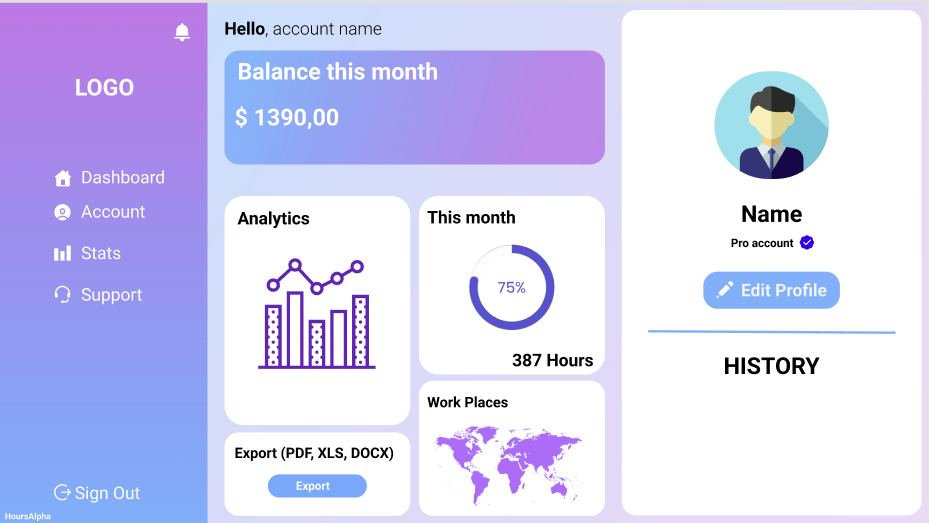

# Hours-Alpha 🗂

*Naša aplikácia bude slúži pre zamestnávateľov, aby mali jednoduchší prehľad o svojich zamestnancoch. Zamestnanci si budú zapisovať hodiny (poprípade miesto kde pracujú) a dáta o zamestnancoch bude vidieť zamestnávateľ v grafoch. Na zákl. počtu hodín sa vypočíta čistá mzda, ktorú dostane daným zamestnanec. Dokument o vypracovaných hodinách, vypočítanej mzde a ostatných informáciách si bude vedieť user aj admin exportovať do excelu/pdf.*

## 1) Úvodná strana

## 2) Dashboard 
  1. Rozličné pre Admina a pre klasického užívateľa
  2. Užívateľ (zamestnanec) má prístup len do zákl. funkcií
  3. Admin (zamestnávateľ) môže spravovať skupiny zamestnancov aj samotných zamestnancov

## 3) Admin UI
  1. *Obrázok pridáme neskôr*
  
## 4) User UI
  

## 5) Grafy s dátami o užívateľoch
  1. Prístup len zamestnávateľ (admin účet)
  2. *Obrázok pridáme neskôr*

## Stihnúť do 22.02.2022 🟣
  1. Zákl. navigácia pomocou dashboardu (Admin a user rôzny dashboard)
  2. Login/SignUp na úvodnej stránke
  3. Základný dizajn apky (figma)
  4. Vytvoriť databázu
  5. Pripojiť databázu
  6. SpringBoot Security
